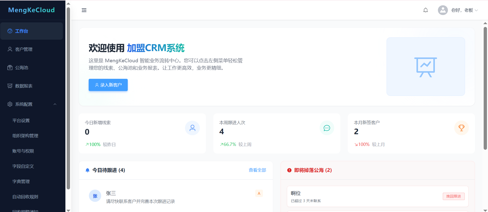
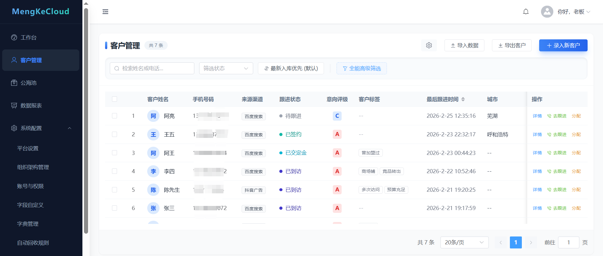
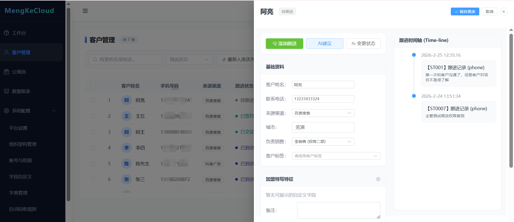
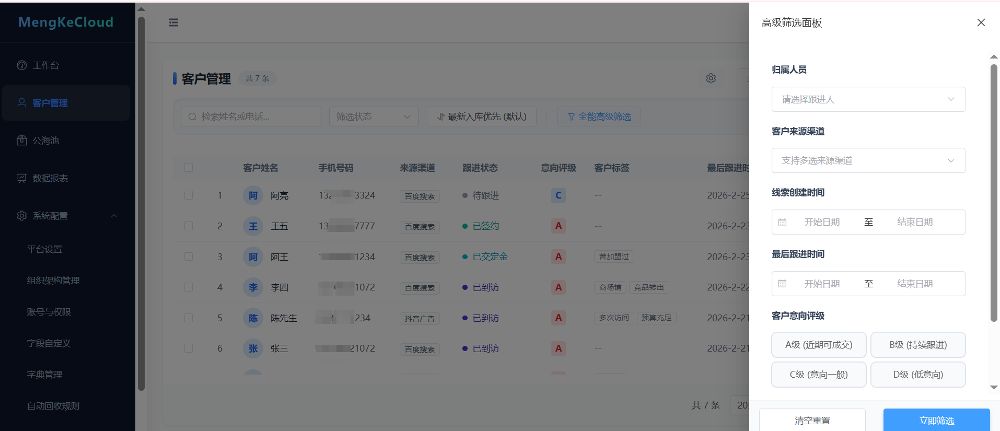
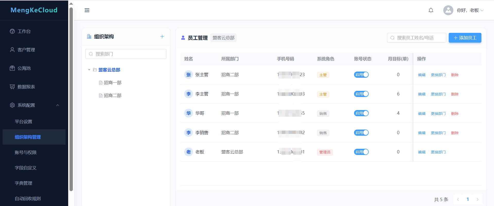
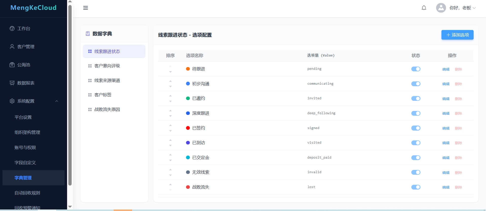

<div align="center">

# MengKeCloud CRM

新一代面向招商加盟业务的智能 CRM 系统，打通客户获取、跟进转化、公海流转与签约复盘全流程

<p>
  
  
  
  
  
</p>

<p>
  客户管理 · 公海池 · 跟进记录 · 数据报表 · 组织权限 · AI 跟进建议
</p>

</div>

---

## 目录

- [功能概览](#功能概览)
- [技术栈](#技术栈)
- [安装部署](#安装部署)
- [访问方式](#访问方式)
- [默认管理员账号](#默认管理员账号)
- [项目目录](#项目目录)
- [关键配置](#关键配置)
- [上线前检查](#上线前检查)

## 功能概览

- 客户管理：录入客户、状态流转、筛选查询、导入导出、批量分配
- 跟进管理：跟进记录、时间线、状态更新、AI 建议辅助
- 公海池：捞取客户、定向分配、流转审计、回收通知
- 数据报表：工作台指标、趋势图、漏斗分析
- 组织权限：部门、员工、角色菜单权限
- 平台设置：企业信息、回收规则、AI 模型参数与联通测试
- 安全机制：JWT 认证、首登强制改密、管理员重置密码

## 系统截图

<div align="center">
  
  <br/><br/>
  
  <br/><br/>
  
  <br/><br/>
  
  <br/><br/>
  
  <br/><br/>
  
</div>

## 技术栈

- 前端：Vue 3、Vue Router、Element Plus、Vite、ECharts
- 后端：FastAPI、SQLAlchemy (Async)、Alembic、PostgreSQL
- 认证：JWT Access/Refresh Token
- 可选中间件：Redis（按配置启用）
- 部署：Docker Compose（推荐）/ Linux 脚本

## 运行环境版本

- Python：`3.11+`（推荐 `3.11`）
- Node.js：`20+`（推荐 `20 LTS`）
- 数据库：`PostgreSQL 14+`（推荐 `16`）
- 可选缓存：`Redis 7+`

## 安装部署

### 安装前准备（必看）

请先确认下面这些条件：

- 一台 Linux 服务器（推荐 Ubuntu 22.04+）
- 已安装 Docker 与 Docker Compose
- 已开放端口：`8081`（前端）、`8082`（后端 API，可选对外）
- 可以拉取代码仓库（`git clone` 正常）
- 可选：域名（没有也可先用服务器 IP）
- 可选：AI Key（没有可先关闭 AI）

如果你暂时没有某项：

- 没有域名：先用 `http://<服务器IP>:8081/` 访问
- 没有 AI Key：把 `.env` 里 `MENGKE_AI_ENABLED=false`
- 只想先开放后台页面：先开放 `8081` 即可

### 一键部署（推荐，小白 3 步）

1. 拉取代码

```bash
git clone <your-repo-url> mengkecloud
cd mengkecloud
```

2. 复制配置模板

```bash
cp .env.docker.example .env
```

3. 编辑 `.env` 后启动

必改项：

- `POSTGRES_PASSWORD`
- `MENGKE_JWT_SECRET_KEY`
- `MENGKE_BOOTSTRAP_ADMIN_PHONE`
- `MENGKE_BOOTSTRAP_ADMIN_PASSWORD`

修改示例（直接改 `.env`）：

```env
POSTGRES_PASSWORD=YourDbStrongPass_2026
MENGKE_JWT_SECRET_KEY=YourJwtSuperLongRandomSecretAtLeast32Chars
MENGKE_BOOTSTRAP_ADMIN_PHONE=13900000000
MENGKE_BOOTSTRAP_ADMIN_PASSWORD=YourAdminStrongPass_2026
```

可用下面命令生成随机 JWT 密钥：

```bash
openssl rand -hex 32
```

> 默认值仅用于本地演示，不建议用于正式上线。

启动命令：

```bash
docker compose up -d --build
```

可选：启用 Redis

```bash
docker compose --profile redis up -d --build
```

## 访问方式

- 前端后台：`http://<你的服务器IP>:8081/`
- 后端 API：`http://<你的服务器IP>:8082/`
- API 文档：`http://<你的服务器IP>:8082/docs`

## 默认管理员账号

账号来自 `.env` 中的 bootstrap 配置，不是硬编码死值。

- 手机号：`MENGKE_BOOTSTRAP_ADMIN_PHONE`
- 密码：`MENGKE_BOOTSTRAP_ADMIN_PASSWORD`

若你未改模板默认值，则为：

- 手机号：`13800000001`
- 密码：`ChangeMe123!`

首次登录会强制修改密码。

## 项目目录

```text
MengKeCloud/
  app/                         # 后端主代码
    api/v1/endpoints/          # API 路由
    services/                  # 业务逻辑
    repositories/              # 数据访问
    models/                    # ORM 模型
    schemas/                   # 请求/响应模型
  src/                         # 前端源码
  alembic/                     # 数据库迁移
  scripts/                     # 运维脚本
  deploy/nginx.conf            # Web 容器 Nginx 配置
  docker-compose.yml           # 一键部署编排
  Dockerfile.api               # 后端镜像
  Dockerfile.web               # 前端镜像
```

## 关键配置

- `MENGKE_AUTH_ENABLED=true`（生产必须）
- `MENGKE_JWT_SECRET_KEY`（生产必须替换为强随机字符串）
- `MENGKE_AI_ENABLED`、`MENGKE_AI_API_KEY`（启用 AI 时）
- `POSTGRES_*`（数据库连接）

## 上线前检查

- `.env` 已替换默认密码和密钥
- 容器已正常启动
- 可访问 `/health`、`/docs`
- 管理员可登录并完成首次改密
- AI 联通测试通过（如启用 AI）

---
## 📄 开源协议

MIT License

## 👨‍💻 作者

haoyuedashi
